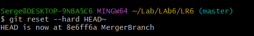

# LR6
## Лабораторная работа №6

### Цель 
Изучение базовых возможностей системы управления версиями, опыт работы с Git Api, опыт работы с локальным и удаленным репозиторием.

### Используемые команды
git clone

git pull

git log 

git merge 

git status

git add .

git commit -m "Name"

git branch -d branch1

git reset --hard HEAD^

git checkout 

git push origin report

### Ход работы
Создаем копию в личное хранилище из https://github.com/Kurtyanik/LR6/ (Fork)

Клонировать свой личный удалённый репозиторий на компьютер

Добавление файлф через интерфейс GitHub. Подтягивание изменения в локальный репозиторий

Получение историю операций для каждой из веток. 

Просмотреть последние изменения. 

Слияние branch1 в ветку master, разрешив конфликт.

Удаление побочной ветки после успешного слияния.

Создание изменений 

Откат коммита. 

Создание ветки для отчёта. 

Историю операций в форматированном виде 

Отправление локальнх изменений в сетевое хранилище GitHub c помощью команды git push

### Вывод

Изучены базовые возможности системы управления версиями, получен опыт работы с Git Api, опыт работы с локальным и удаленным репозиторием. 
